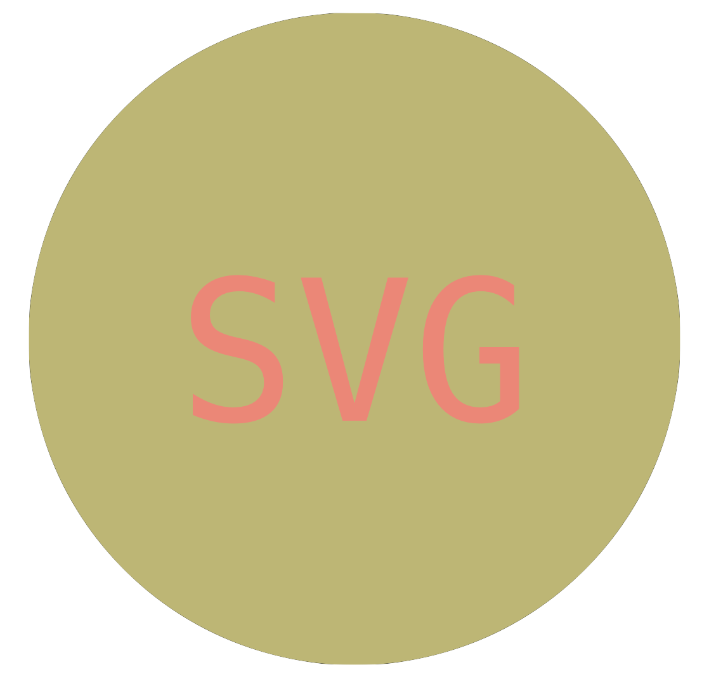
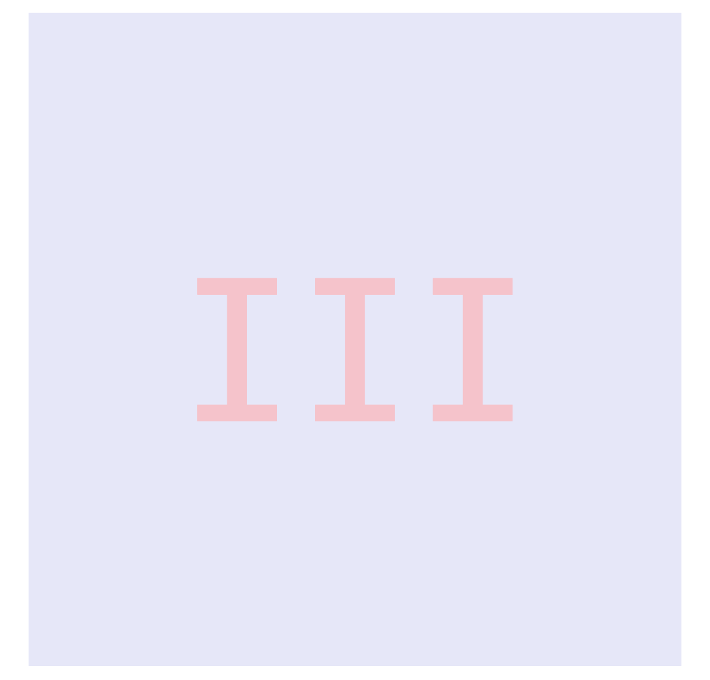
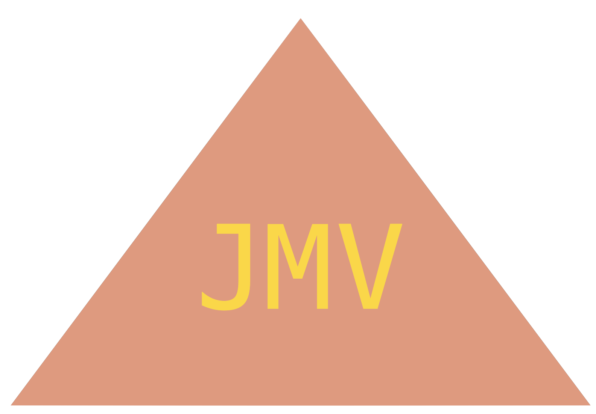
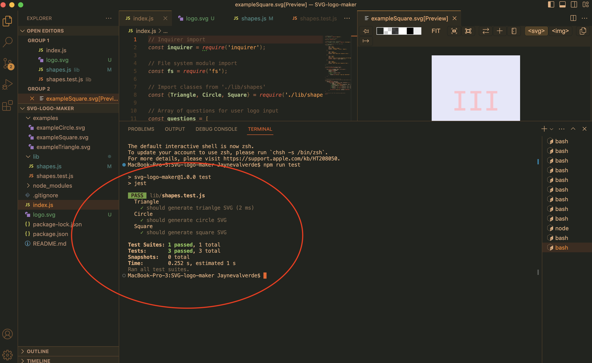

# SVG-logo-generator
### Jayné M. Valverde

## Description:
Object Oriented Programming

### **_[LINK TO WALKTHROUGH VIDEO](https://youtu.be/YrFg9fPl6eM)_**

## Table of Contents
* [User Story](#user-story)
* [Installation](#installation)
* [Usage Information](#usage-information)
* [Test Instructions](#test-instructions)
* [Screenshots](#screenshots)
* [Resources](#resources)

## User Story:
"Lorem ipsum dolor sit amet, consectetur adipiscing elit, sed do eiusmod tempor incididunt ut labore et dolore magna aliqua. Ut enim ad minim veniam, quis nostrud exercitation ullamco laboris nisi ut aliquip ex ea commodo consequat. Duis aute irure dolor in reprehenderit in voluptate velit esse cillum dolore eu fugiat nulla pariatur. Excepteur sint occaecat cupidatat non proident, sunt in culpa qui officia deserunt mollit anim id est laborum."

## Installation: 
"Sed ut perspiciatis unde omnis iste natus error sit voluptatem accusantium doloremque laudantium, totam rem aperiam, eaque ipsa quae ab illo inventore veritatis et quasi architecto beatae vitae dicta sunt explicabo. Nemo enim ipsam voluptatem quia voluptas sit aspernatur aut odit aut fugit, sed quia consequuntur magni dolores eos qui ratione voluptatem sequi nesciunt. Neque porro quisquam est, qui dolorem ipsum quia dolor sit amet, consectetur, adipisci velit, sed quia non numquam eius modi tempora incidunt ut labore et dolore magnam aliquam quaerat voluptatem. Ut enim ad minima veniam, quis nostrum exercitationem ullam corporis suscipit laboriosam, nisi ut aliquid ex ea commodi consequatur? Quis autem vel eum iure reprehenderit qui in ea voluptate velit esse quam nihil molestiae consequatur, vel illum qui dolorem eum fugiat quo voluptas nulla pariatur?"

## Usage Information:
Lorem ipsum dolor sit amet, consectetur adipiscing elit, sed do eiusmod tempor incididunt ut labore et dolore magna aliqua. Pharetra magna ac placerat vestibulum lectus. Ut lectus arcu bibendum at varius.

## Test Instructions:

## Screenshots:
 
 
 
 
 

<!-- 
* Screenshot of testing passed -->

## Resources: 
* **[Youtube: JavaScript super keyword ](https://www.youtube.com/watch?v=khuDeNwXkfI)**

* **[Youtube: Prototype basics](https://www.youtube.com/watch?v=YkoelSTUy7A&t=902s)**

* **[Youtube: Prototypes in JavaScript](https://www.youtube.com/watch?v=riDVvXZ_Kb4&t=18s)**

* **[Mozilla](https://developer.mozilla.org/en-US/docs/Web/SVG/Tutorial/Basic_Shapes)** : Basic Shapes 

* **[Mozilla](https://developer.mozilla.org/en-US/docs/Web/JavaScript/Reference/Classes/constructor)** : Constructor class 

* **[Mozilla](https://developer.mozilla.org/en-US/docs/Web/JavaScript/Reference/Operators/super)** : Super; expressions 

* **[SVG Exstention for VS Code](https://marketplace.visualstudio.com/items?itemName=jock.svg)**

