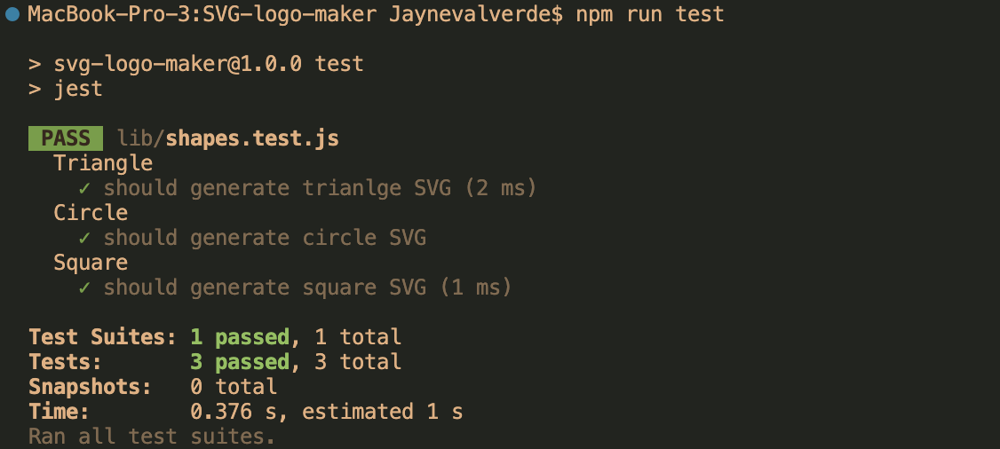
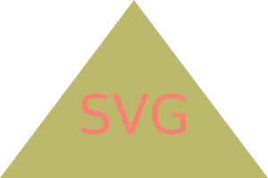

# SVG-logo-generator
### Jayné M. Valverde

## Description:
***Object Oriented Programming*** <br>
This application will take a users input, generate a logo and save it as an SVG file. The application prompts the user to select a color, shape and to provide text for the logo. Once done, a generated SVG file can be saved. 

### **_[LINK TO WALKTHROUGH VIDEO](https://youtu.be/YrFg9fPl6eM)_**

## Table of Contents
* [User Story](#user-story)
* [Acceptance Criteria](#acceptance-criteria)
* [Installation](#installation)
* [Usage Information](#usage-information)
* [Test Instructions](#test-instructions)
* [Screenshots](#screenshots)
* [Resources](#resources)
* [Questions](#questions)

## User Story:
```
AS a freelance web developer 
I WANT to generate a simple logo for my projects 
SO THAT I don't have to rely strictly on the expertise of a graphic designer 
```
## Acceptance Criteria: 
```
GIVEN a command-line application that accepts user input 
WHEN I am prompted for a shape
THEN I am presented with a list of shapes to choose from: Triangle, Circle, Square
WHEN I am prompted for the shape's color
THEN I can enter a color keyword
WHEN I am prompted for text
THEN I can enter up to three characters 
WHEN I am prompted for the text color 
THEN I can enter a color keyword
WHEN I have entered input for all the prompts
THEN an SVG file is created named `logo.svg`
```

## Installation: 
To use this application, you will need to follow these instructions and download the follwing: <br>

1. Clone the repot: git clone https://github.com/JayneValverde/SVG-logo-maker.

2. Open in VS Code. You must install VS code if you do not have it already. 

3. Install Node.js (preferably node.js v16).

4. In the terminal, utilize the command ***npm init -y*** to initialize and create a package.json where files will be stored.

5. In the terminal, run the command ***npm i*** to install the dependencies associated with this applicaiton. 
    * **npm i jest** 
    * **npm i inquirer@8.2.4** 

6. Type **node index.js** within the terminal to run the application. 

## Usage Information:
Once all the necessary programs and Node.js packages have been installed, follow these steps for use: 

1. In the command line, use the command "node index.js" to invoke the applicaiton. 

2. The application will begin asking you for input; The application will use this information to generate the SVG file. 

3. Once you've gone through all the prompts, you will be able to find "logo.svg" within VS Code files. To preview your logo within VS Code, you will have to install an extension for SVG. (I have included a link for the extention in the ***resources*** section) --- You can right click "logo.svg" and select 'Preview SVG'. 

4. Once you are ready to save your SVG file, right click on "logo.svg" and click 'Download' and save the file to the file of your choice. 

## Test Instructions:
* To run testing, open the terminal and use the command ***npm run test*** <br>
* This test suit check for a render() method to return a string for the corresponding SVG file with a given shape color.  <br>

     <br>

## Screenshots:
<br>
 
 
 
<br>

## Resources: 
* **[Youtube: JavaScript super keyword ](https://www.youtube.com/watch?v=khuDeNwXkfI)**

* **[Youtube: Prototype basics](https://www.youtube.com/watch?v=YkoelSTUy7A&t=902s)**

* **[Youtube: Prototypes in JavaScript](https://www.youtube.com/watch?v=riDVvXZ_Kb4&t=18s)**

* **[Mozilla](https://developer.mozilla.org/en-US/docs/Web/SVG/Tutorial/Basic_Shapes)** : Basic Shapes 

* **[Mozilla](https://developer.mozilla.org/en-US/docs/Web/JavaScript/Reference/Classes/constructor)** : Constructor class 

* **[Mozilla](https://developer.mozilla.org/en-US/docs/Web/JavaScript/Reference/Operators/super)** : Super; expressions 

* **[SVG Exstention for VS Code](https://marketplace.visualstudio.com/items?itemName=jock.svg)**

## Questions: 
Follow me on Github at [JayneValverde](https://github.com/JayneValverde) or feel free to contact me at Jaynevalverde@gmail.com. <br>
Thank you!
